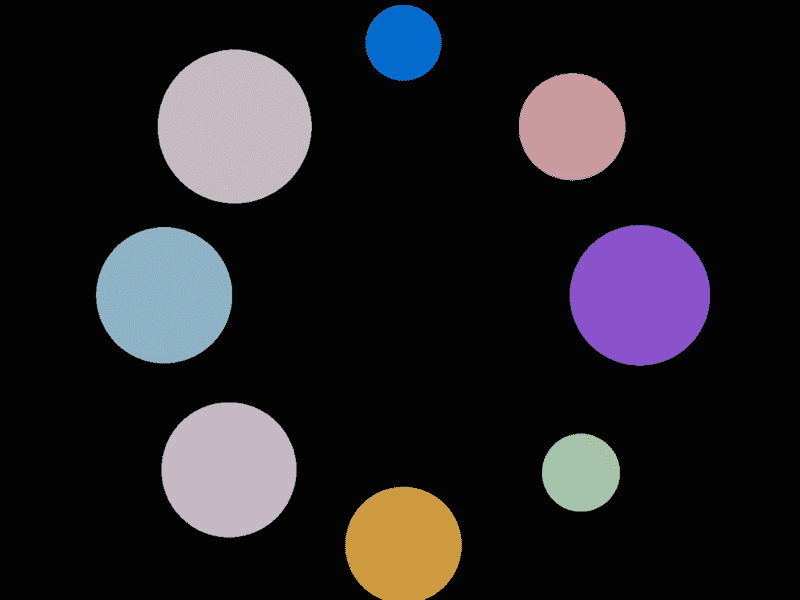

# Spheruby

Simple physical simulation of spheres that attract each other through gravity, and then bounce off each other.

Little toy project I made to teach myself the basics of Ruby.



## Installation

Tested on Ruby 2.7.2.

Uses the [Gosu library](https://github.com/gosu/gosu) for graphics. It requires SDL 2 as a system dependency. To install
on Mac:

```
brew install sdl2
# On Apple M1, you need to do this right now:
# arch -x86_64 brew install sdl2
```

After that, install dependencies with `bundle install`, and the run tests via `rake spec`.

Run `rake run` to start the application.